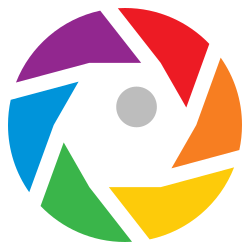

<p align="center">
  
</p>

<h1 align="center">Lens</h1>

<p align="center">
  <strong>Describe it. Find it.</strong>
</p>

<p align="center">
  <a href="https://craftcms.com"></a>
  <a href="https://php.net"></a>
  <a href="#license"></a>
  <a href="https://github.com/vitordiniz22/craft-lens/actions/workflows/tests.yml"></a>
</p>

Lens runs every image in your asset library through an AI model and fills in the metadata that should have been there: alt text in each of your site's languages, a descriptive title, a focal point on the actual subject, and flags for NSFW content, visible watermarks, named brand logos, and people in the shot. It can also audit images locally for blur, exposure, contrast, compression, and color profile issues when Image Assessment is enabled. All of that is free in the Lite edition.

Pro makes the library searchable by what's actually in each image: long descriptions, semantic tags, and OCR'd text are indexed into Craft's native search and every image picker, so editors find photos by content instead of filenames or folder structure. Pro also bulk-processes entire volumes, catches visually duplicate uploads, and tracks AI spend.

Bring your own API key for **OpenAI**, **Google Gemini**, or **Anthropic Claude**, and switch whenever. You pay the provider directly; there's no middleman.

## How It Works

1. **Drop in images.** Lens analyzes them automatically on upload, on demand from the asset editor, or in bulk across entire volumes.
2. **Get rich metadata in one pass.** Alt text in every site language, descriptions, 35+ semantic tags, focal points, NSFW and watermark flags, and OCR'd text, all from a single AI call per image.
3. **Find everything, immediately.** Lens metadata feeds Craft's native search, pre-built sources, and condition rules across the asset browser and every image picker.

## Features

### Search & Discovery

- **Search by what's in the picture.** `[Pro]` Type *"outdoor"*, *"team meeting"*, into Craft's asset search and Lens ranks results by AI-generated tags, descriptions, alt text, and OCR, alongside Craft's native title and filename matching. The same smart search powers every image picker on every entry, so editors find the right photo without leaving the entry they're writing.
- **Pre-built views in your asset library.** Not Analyzed, Failed Analyses, Missing Alt Text, NSFW Flagged, Missing Focal Point, Contains People, Has Watermark, Has Brand Logo. Build your own with Lens condition rules.
- **Duplicate detection** `[Pro]` surfaces visually similar images so you stop re-uploading the same file, flags duplicates on each asset's edit page, and lets you find similar images to any asset on demand.

### Automatic Tagging & Descriptions

- **Alt text** generated in each site's language, with translations for multisite installs and confidence scoring
- **Title suggestions** that replace Craft's auto-generated titles with meaningful, descriptive names
- **Long descriptions** `[Pro]` that give images rich context and feed the search index for better discoverability
- **Semantic tags** `[Pro]` that actually describe what's in the image, 35-40 per asset, each scored by confidence

### Editorial Control

- **Inline editing** for every AI-generated field on the asset edit page: alt text, titles, descriptions, tags, focal points, and detection flags (people, NSFW, watermark, brand)
- **Custom tags** added by editors live alongside AI tags, with autocomplete from tags already in your library
- **Revert to AI** restores any field to its original AI value in one click
- **Edits survive re-analysis**: re-running an asset only overwrites AI-only output, never the corrections you've made

### Content Detection

- **Faces and people** with 6-tier detection: no people, people without visible faces, individual, duo, small group, large group
- **NSFW scoring** with category breakdown (adult, violence, hate, self-harm, drugs) to catch unsafe content before it goes live
- **Watermarks** identified by type (text, logo, stock, copyright) to flag assets that may need review before publishing
- **Brand/logo recognition** names the specific brands in each image and lets you filter by brand in custom views, with full search-box ranking on Pro
- **Focal point detection** generates a focal point suggestion on the primary subject and applies it to assets that don't already have one, so Craft's image transforms crop around what matters
- **OCR** `[Pro]` extracts text from images, fully searchable

### Image Assessment

- **Quality analysis** flags blurry or soft images, ones that are too dark or too bright, low-contrast (flat) shots, heavily compressed files, and non-sRGB color profiles, with a recommendation for each issue. Disabled by default; requires Imagick.

### Bulk Processing `[Pro]`

- **Analyze entire volumes** with real-time progress tracking, cost estimation, and volume-scoped retry for failed assets

### Language & Multisite

- **Language-aware AI** generates all text in your site's language. English site gets English alt text. Add a Spanish site and Lens generates Spanish too.
- **Per-site alt text & titles** for multisite installs with different languages, with native translations for each site generated in a single AI request, without re-sending the image per language
- **Base-language grouping** means `en-US` and `en-GB` share one English translation, `fr-FR` and `fr-CA` share one French translation, so no API calls are wasted
- **Zero configuration** because Lens reads your site languages and volume translation settings automatically

## Editions

### Lite, for single editors and small libraries

Every image gets AI-generated alt text, focal points, NSFW and watermark flags, brand recognition and much more. Craft's asset library gets 9 pre-built filtered views and 11 condition rules so you can navigate by what's actually in the picture, not just the filename. Free. Always.

**Lite includes:**

- Generates alt text, descriptive titles, and focal points for every uploaded image
- Analysis panel on the asset editor to review, edit, or revert any AI-generated field inline
- Detects what's in the image: people and faces, unsafe content, watermarks, and named brand logos
- Audits image quality: blur, exposure, low contrast, heavy compression, and non-sRGB color profiles, with a recommendation per issue
- Multisite-ready: each site gets alt text and titles in its own language
- Adds 9 pre-built views and 11 condition rules to Craft's native asset library
- Bring your own API key: OpenAI, Google Gemini, or Anthropic Claude

### Pro, for teams and libraries that grow

Pro turns your image library into a searchable knowledge base. Search across alt text, descriptions, semantic tags, and OCR'd text, in Craft's asset browser and inside every image picker. Bulk-process entire volumes with cost preview and retry. Catch duplicates before they multiply.

**Pro adds:**

- Searches across alt text, long descriptions, tags, and OCR text in Craft's asset library and every image picker
- Generates long descriptions and 35+ semantic tags per image
- Extracts text from screenshots, signs, and document images
- Inline tag editing on the analysis panel to add or remove tags
- Bulk-processes entire volumes with progress, cost estimates, and retry for failed assets
- "Analyze with Lens" bulk action in the asset index for queueing analysis on selected images
- Detects duplicate images via perceptual hashing
- Tracks AI spend by month and provider/model, with token usage and per-asset averages
- Adds 1 more view and 7 more condition rules to Craft's native asset library

Available on the <a href="https://plugins.craftcms.com/lens" target="_blank" rel="noopener">Craft Plugin Store</a>.

## Requirements

- **Craft CMS** 5.0.0 or later
- **PHP** 8.2 or later
- **MySQL** 8.0+, **MariaDB** 10.6+, or **PostgreSQL** 14+
- An API key from one of: [OpenAI](https://platform.openai.com/), [Google AI](https://ai.google.dev/), or [Anthropic](https://www.anthropic.com/)
- **Imagick PHP extension** (recommended) enables local quality metrics (sharpness, brightness, contrast, compression quality, and color profile detection). Without it, those metrics are hidden; the rest of the Image Assessment section still works.

## Installation

### From the Plugin Store

1. Go to **Settings** &rarr; **Plugins** in your Craft control panel
2. Search for "Lens"
3. Click **Install**

### With Composer

```bash
composer require vitordiniz22/craft-lens
php craft plugin/install lens
```

### Getting Started

1. Navigate to **Lens** &rarr; **Settings** in the control panel
2. Select your AI provider (OpenAI, Gemini, or Claude)
3. Enter your API key (supports environment variables like `$OPENAI_API_KEY`, `$GEMINI_API_KEY`, or `$ANTHROPIC_API_KEY`) and choose a model
4. Choose which volumes to enable for analysis
5. Optionally enable **Image Assessment** if Imagick is available
6. In each enabled volume's field layout (**Settings** &rarr; **Assets** &rarr; *[Volume]* &rarr; **Field Layout**), drag the **Lens Analysis** UI component into the layout so AI results appear on the asset editor
7. Upload an image. Lens analyzes it automatically and displays results in the **Lens Analysis** panel on the asset editor.

## Documentation

Full documentation is available on the [GitHub Wiki](https://github.com/vitordiniz22/craft-lens/wiki), including:

- [Getting Started](https://github.com/vitordiniz22/craft-lens/wiki/Getting-Started)
- [Configuration](https://github.com/vitordiniz22/craft-lens/wiki/Configuration)
- [Console Commands](https://github.com/vitordiniz22/craft-lens/wiki/Console-Commands)
- [Templating](https://github.com/vitordiniz22/craft-lens/wiki/Templating)
- [Asset Query Extensions](https://github.com/vitordiniz22/craft-lens/wiki/Asset-Query-Extensions)
- [Condition Rules](https://github.com/vitordiniz22/craft-lens/wiki/Condition-Rules)
- [Editions](https://github.com/vitordiniz22/craft-lens/wiki/Editions)
- [Cost & Pricing](https://github.com/vitordiniz22/craft-lens/wiki/Cost-and-Pricing)
- [Privacy & Data](https://github.com/vitordiniz22/craft-lens/wiki/Privacy-and-Data)

## Support

- **Bugs**: Report via [GitHub Issues](https://github.com/vitordiniz22/craft-lens/issues). Include your Craft version, PHP version, the AI provider you're using, and clear reproduction steps.
- **Feature requests**: Also via GitHub Issues. Describe the use case so it can be prioritized against other work.
- **Security issues**: Please do not file public issues for security concerns. Use GitHub's private [security advisory](https://github.com/vitordiniz22/craft-lens/security/advisories/new) instead.

## License

This plugin is distributed under the Craft License. See [LICENSE.md](./LICENSE.md) for the full terms.
